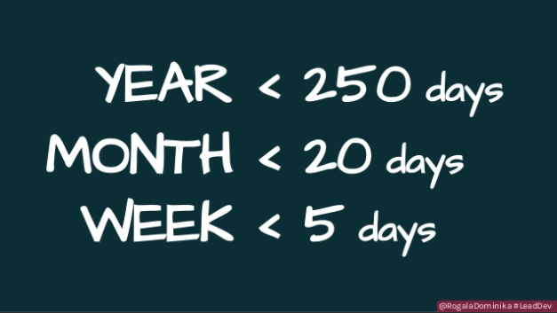

import { YouTube } from '@astro-community/astro-embed-youtube';

One June 8th and 9th I attended the Lead Developer Conference in London England. The two-day conference, geared towards Managers, Directors, VPs and CTOs, was extremely well planned and executed, and all of the speakers were top notch. In this post I’ll be summarizing and highlighting half of the talks from Day 1.

*If you're interested in reading the other summaries you can do so for the [second half of the first day](/posts/2017-lead-dev-conf-day1-pt2) and the [second day](/posts/2017-lead-dev-conf-day2).*

## Patrick Kua — The Constant Life of a Tech Lead
Patrick started the conference off speaking about day to day life of a technical lead and how that differs from being a developer. He spoke about how principles outlast the tools you use. If you can learn the underlying principle you’ll be able to use it regardless of the tools your company uses.

He then went on to talk about Hofstede’s Cultural Dimensions. This framework describes the effects of a society’s culture on its members. He tied it back into an overarching theme of the conference that the more diverse a team is, the stronger.

> “What is important is seldom urgent and what is urgent is seldom important.” — Dwight Eisenhower  

Finally, Patrick spoke on how systems will always change but time is a constant. He used the Eisenhower Matrix and Double Loop Learning to decide on what to work on with your limited time and how to improve the way you learn from your actions to improve the speed at which you can make decisions.

<YouTube id="9jd_vpcLK50" />

## Dominika Rogala — Things you wish you shared with your team before they agreed on that deadline
> “To help your team hit their deadlines make sure they’re aware of the time, traps and priorities”  

Dominika’s talk was the shortest of the conference but packed with tonnes of useful information all centred around making sure your team has the correct and necessary information before they give you deadlines.

There’s a lot of information that I keep stored in my head that allows me to make better/faster decisions that I need to share with my team. This information has been stored up over the years and I need to find better ways to make it available (and searchable).
da

The other thing that I took away from this talk was that a work day isn’t 8 hours, a week isn’t 5 days, a month isn’t 20 days and a year isn’t 250 days. Developers aren’t able to focus 100% of their time on coding and while this should be fairly obvious it’s often overlooked when deadlines are created.

<iframe src="https://www.slideshare.net/slideshow/embed_code/key/uoTjuGzBVlZCVe" width="100%" height="485" frameborder="0" marginwidth="0" marginheight="0" scrolling="no" style="border:1px solid #CCC; border-width:1px; margin-bottom:5px; max-width: 100%;" allowfullscreen> </iframe>

## Adrian Howard — How to talk to Earthlings
I’ll admit that when I saw the title of this talk I was initially sceptical. I’ve never been a fan of the “Developer’s are different than regular humans” trope and was worried this talk would heavily lean on that theme. I was pleasantly surprised that this talk was extremely well laid out, well presented and wasn’t at all condescending.

> “Management is the art of getting things done through people” — Mary Parker Follett  

Adrian spoke on how to improve your conversation skills and used a number of examples on how to improve your 1:1’s. I found myself taking a number of notes, not only from materials presented but also on how I could improve things with my current team.

His five tips for improving your conversational skills were:
* Shut up.
* Stay quiet.
* Reflect back.
* Ask for Stories.
* Insights vs Observations

<iframe src="https://www.slideshare.net/slideshow/embed_code/key/xlp54SBAZw1Bik" width="100%" height="485" frameborder="0" marginwidth="0" marginheight="0" scrolling="no" style="border:1px solid #CCC; border-width:1px; margin-bottom:5px; max-width: 100%;" allowfullscreen> </iframe>

## Katherine Wu — Ask vs. Guess Cultures
Katherine spoke on the differences between Ask and Guess Cultures. These were terms I was unaware of before and I pulled a lot of information out, both for work and for my personal life. If you’re part of the “Ask” culture you’re generally ok to ask any question and you’re ok accepting a no as an answer. If you associate more with the “Guess” culture you’re more likely to avoid asking a question unless you’re positive the answer will be a yes.

I took a number of things away from this talk on how I communicate with my teammates. Since I consider myself on the Ask side I also need to be careful with my assumption that silence == ok. Sometimes people, especially more on the “Guess” side, won’t speak up unless they’re 100% comfortable. People also like to communicate differently. Some prefer to communicate more asynchronously (through Slack or Email) while others prefer more structured 1:1’s. These differences also are true for how people wish to receive feedback. Katherine talks about how some prefer immediate feedback while others prefer time to collect their thoughts and respond to the feedback.

<iframe class="speakerdeck-iframe" frameborder="0" src="https://speakerdeck.com/player/791b2040c3334b328071225658170353" title="Ask vs. Guess Culture Communication (The Lead Developer UK)" allowfullscreen="true" mozallowfullscreen="true" webkitallowfullscreen="true" style="border: 0px; background: padding-box padding-box rgba(0, 0, 0, 0.1); margin: 0px; padding: 0px; border-radius: 6px; box-shadow: rgba(0, 0, 0, 0.2) 0px 5px 40px; width: 100%; height: 314px;" data-ratio="1.78343949044586"></iframe>

## Maria Gutierrez — Time to Focus on Your Goals
Maria spoke about the importance of investing in your development as a manager, building out your team’s goals and your plan. She also spoke on how to prioritize information when there’s so much that you can consume as a manager.

One of the things I took away from this talk that I’ll be implementing is taking a full day to work on your plan and set your goals. Sitting down, getting into the correct mindset and evaluating all of the different paths your team can take is extremely important and something that I’ve never thought of doing before.

Finally, as a leader you always need to be learning, evaluating your performance and course correcting. I’ve always focused on my team and this is an area I’ve neglected since I became a leader. It’s easy as a developer to track your performance and learn new tools, it’s more difficult with soft skills.

<iframe class="speakerdeck-iframe" frameborder="0" src="https://speakerdeck.com/player/304f2f87ddc1429c9850f6347f1084d1" title="Lead Dev UK 2017 - Time to focus on your goals" allowfullscreen="true" mozallowfullscreen="true" webkitallowfullscreen="true" style="border: 0px; background: padding-box padding-box rgba(0, 0, 0, 0.1); margin: 0px; padding: 0px; border-radius: 6px; box-shadow: rgba(0, 0, 0, 0.2) 0px 5px 40px; width: 100%; height: 314px;" data-ratio="1.78343949044586"></iframe>

As you can see, The Lead Developer Conference was absolutely packed with fantastic talks and useful information. The six talks all happened before lunch on the first day.

Here’s the  [second half of Day 1](https://tech.gadventures.com/the-lead-developer-conference-day-1-part-2-c12ce125cbbc)  and  [Day 2.](https://tech.gadventures.com/the-lead-developer-conference-day-2-dfb8ddf318a2?source=linkShare-5c397335161c-1504708025) 

