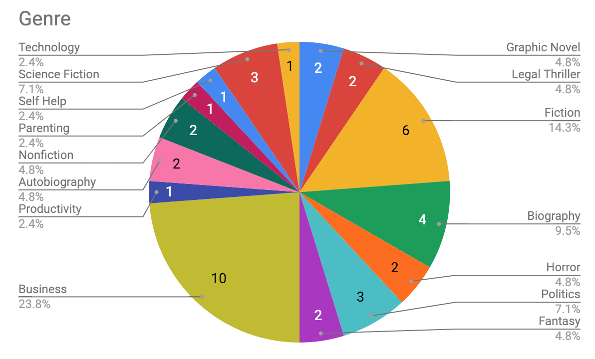

In 2018, I read [42 books](https://www.goodreads.com/review/list/7269489-adam?shelf=2018).

This was the first time in over 15 years that I really set out to read a lot of books. I used to curl up on a couch or hang out in my bedroom all day reading until my parents forced me to go outside or come to dinner. Then high school, university, work, parenthood and numerous other things got in the way and I never got back into reading.

That changed in 2018 after talking with [Ian MacNeill](https://medium.com/u/3a50753576d0?source=post_page-----51cf92a90097--------------------------------) and seeing how much he read in 2017. At the same time, I was also looking into how I was spending my time and decided I wanted to spend time reading instead of watching Youtube and Netflix.

Now, I couldn’t just read books and not track what I read.

## Favourite Books
Before I deep dive into statistics and the full list of books I thought I’d mention my favourites.

### [Bad Blood: Secrets and Lies in a Silicon Valley Startup](http://amzn.to/2AqmT8T)
I found Bad Blood riveting, I literally couldn’t put it down. I work in [Tech](http://sentry.io/) and followed along loosely to what was happening at Theranos but I never all of the details. To see someone so adept at lying and manipulating is chilling. There were also a lot of anti-patterns when it came to management that I took away.

### [Beyond the Castle: A Guide to Discovering Your Happily Ever After](https://amzn.to/2RuHxye)
I’m a big fan of Disney, especially the parks and I found this book really interesting. I liked all of the personal stories and the little extra pieces of information as to how Disney runs such a tight ship. Just as a warning for those who aren’t religious, Jody Dreyer is and weaves it throughout the book. In my opinion, it’s done very well and even if you aren’t religious it’s not shoved in your face.

### [Black Edge: Inside Information, Dirty Money, and the Quest to Bring Down the Most Wanted Man on Wall Street](https://amzn.to/2LEZ15K)
I found this book really interesting. The sheer greed and lengths people go to to make money is mind-blowing. There were times where I couldn’t believe the events actually happened in real life. Similar to Bad Blood there was also management anti-patterns that I took away, specifically around siloing information your staff receives.

### [The Everything Store: Jeff Bezos and the Age of Amazon](https://amzn.to/2CIUuwx) and  Elon Musk: Tesla, SpaceX, and the Quest for a Fantastic Future
The main takeaway from these books is that I have no desire to start or run a large company anymore. Sacrificing family and your personal life isn’t worth it. While I found them both very interesting it definitely shed new light onto Jeff Bezos and Elon Musk. I’m impressed at the drive they have and what they’ve been able to accomplish but it’s definitely not a life I want to pursue.

## Statistics
Last year I read/listened to 42 books. You can find the full list [here](https://www.goodreads.com/review/list/7269489-adam?shelf=2018). I listened to 30 audiobooks (at 2x speed) for a total of 154 hours of listening time (6.4 days). This is one of the reasons why I was able to get through so many books. On average it took me 3.8 days to get through an audiobook vs 13.4 days to get through a hard copy. Of the 12 physical books, I read a total of 3225 pages.

Of the 42 books, only 6 were written by women (14%). This is something I’m actively working on in 2019. My goal is to have an even split of female authors to males as well as an even split between race.

On average I was slightly more positive towards the books than the rating on Good Reads. In 27 cases I rated the book more favourably than the community, though my average rating was a 4.09/5 vs 3.97/5 so the difference is very minimal. I rated books pretty evenly regardless of the gender of the author but I did notice that I rated physical books much higher than audiobooks in general (4.4 vs 3.9). This makes sense since I tend to only buy books that I think I’ll be interested in.

Genre-wise I didn’t find anything interesting. I read 10 Business books which made up 23% of everything I wrote. After that came Fiction (14.3%), Biography (9.5%) and Politics and Science Fiction (7.1%).

## Onwards
I already have a couple of goals for 2019. As I mentioned above one of them is to become more mindful of the books I’m reading and who’s writing them. I want to make sure that I’m reading books from a diverse set of authors.

The second goal is to read at least 35 books. I know this goal is less than I did in 2018 but work and personal life are already crazy in 2019 and I‘m not positive I can keep up with what I did last year.

My final goal is to give up on books sooner. I finished a few books that I really wasn’t interested and it showed. By not completing books instead of slogging through them I’m confident I can surpass my reading goal for 2019.
