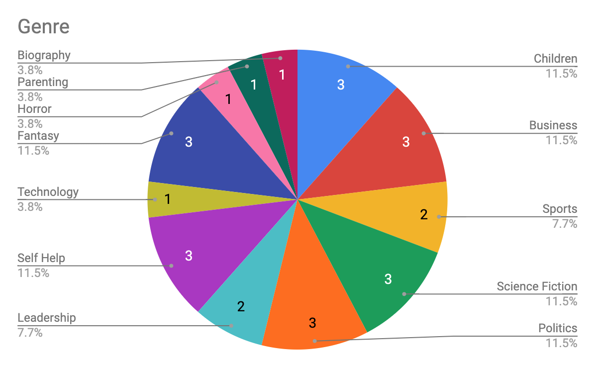

In 2019 I read [26 books](https://www.goodreads.com/review/list/7269489?shelf=2019&sort=date_added&order=d). This was 9 less than the goal I set in [2018](/posts/2018-review-of-the-books-i-read/), this was due to a busy personal life (I had a second kid) and changing roles at my company. I also think I got a little burnt out from reading after a fairly quick start.

## Favourite Books

### [Reset: My Fight for Inclusion and Lasting Change — Ellen Pao](https://amzn.to/3b8SnDQ) 
I followed along as Ellen’s lawsuit was happening against Kleiner Perkins so reading about it from her point of view and all of the events that led up to it was very interesting. The subjects are important and extremely relevant since I’m also in tech. The writing still is simple and easy to get behind and I finished this book extremely quickly.

### [Meltdown: Why Our Systems Fail and What We Can Do About It — Chris Clearfield](https://amzn.to/3b7Nv1G) 
I really liked this book for a number of reasons. The stories were interesting and I was able to tie each one back into a failure I’ve experienced throughout my career. I was expecting this book to be a little dry when I bought it but it was hard to put down once I started.

### [The First 90 Days: Critical Success Strategies for New Leaders at All Levels — Michael D. Watkins](https://amzn.to/3nlTFxL) 
In September I switched roles and picked up this book to help with the transition. The diagrams and worksheets were invaluable and the examples throughout were incredibly useful even though I’ve been managing for the past 8 years.
I’d definitely recommend this book to anyone switching jobs or becoming a manager for the first time.

### [The Martian — Andy Weir](https://amzn.to/38hHde9) 
This is one of my favourite science fiction novels of all time. I love the story, the humour and the actual science that was thoroughly researched. This is also one of the few books where I thought the movie didn’t totally butcher.

## Statistics
Last year I read/listened to 26 books. You can find the full list [here](https://www.goodreads.com/review/list/7269489?shelf=2019&sort=date_added&order=d). I listened to 17 audiobooks (at 1.5x speed) for a total of 122 hours of listening time (5.1 days). This is one of the reasons why I was able to get through so many books. On average it took me 4.3 days to get through an audiobook vs 12.14 days to get through a hard copy. Of the 7 physical books, I read a total of 1246 pages.

Of the 26 books, only 9 were written by women (35%). This was a significant increase over 2018 where 14% of the books I read were written by women. I plan on continuing this trend into 2020.

The trend continues where I rated books slightly more positive than the rating on Good Reads. In 14 cases I rated the book more favourably than the community, though my average rating was a 4.15/5 vs 4.09/5 so the difference is very minimal. I rated books pretty evenly regardless of the gender of the author but I did notice that I rated physical books much higher than audiobooks in general (4.3 vs 4.05). This makes sense since I tend to only buy books that I think I’ll be interested in.

This year I was much more consistent in the genres of books I read. Last year 23% of the books I read fell under the business category. This year Children, Business, Science Fiction, Politics, Self Help and Fantasy all tied for 11.5%

## Onwards
I already have a couple of goals for 2020. I want to continue being mindful of the books I’m reading and who’s writing them and I want to make sure that I’m reading books from a diverse set of authors.

The second goal is to read at least 30 books. This is less than my goal for 2019 but more than I actually read last year. I want to try to be more consistent in the number of books I read in a month. In 2018 there was only a single month where I didn’t read any books, in 2019 there were 4.

My final goal is to read more physical books. I love audiobooks because I can listen to them while I’m walking and driving but I’d really like to get to more physical books. There’s something about flipping through the pages and finally getting to the end that is so much more satisfying than finishing an audiobook.
Here’s to [2020 and more hopefully many more books](https://www.goodreads.com/review/list/7269489?shelf=2020)!
