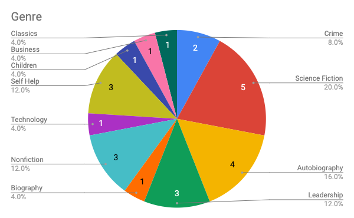

In 2020 I read [25 books](https://www.goodreads.com/review/list/7269489-adam?order=d&shelf=2020). This was 5 less than the goal I set in [2019](/posts/2019-review-of-the-books-i-read/), but, as everyone knows, 2020 was a [doozy](https://media.giphy.com/media/XdIOEZTt6dL7zTYWIo/giphy.gif). I often use my commute to read and with Covid happening, I started working from home which reduced my reading time significantly. In June I also switched companies which reduced the time I had to read even further. Overall I’m happy with the number of books that I finished, including some really good ones.

## Favourite Books

### [Resilient Management – Lara Hogan](https://amzn.to/38eXyQK) 
This was the most useful book I read last year, probably because I [led a book club](/posts/running-an-engineering-book-club/) on it which forced me to really pay attention and write down questions for each chapter. [Lara Hogan](https://larahogan.me/) has always been a source of inspiration and actionable insights into how I can be a better manager and Resilient Management was no different. Whether you’re new to management or a veteran I strongly suggest reading this book.

### [I Am C-3PO: The Inside Story – Anthony Daniels](https://amzn.to/3sdU3BY) 
I love Star Wars and a good number of the books I read are related to it. Getting an inside look into Anthony Daniels’ experience playing C-3PO was a part of the story I hadn’t heard yet. I listened to this on Audible and hearing it from Anthony Daniels directly made it even better.

### [The Better Allies Approach to Hiring – Karen Catlin](https://amzn.to/3br39VR) 
This book opened my eyes to areas that I can improve upon while hiring and building more inclusive teams.  Examples such as tagging photos for accessibility on your career website, rethinking the “dude wall” and understanding the importance of retention definitely resonated with me.

### [A Christmas Carol – Charles Dickens](https://amzn.to/2Xtb24S) 
Growing up  [The Muppet Christmas Carol](https://en.wikipedia.org/wiki/The_Muppet_Christmas_Carol)  was my favourite movie but until this year I had never actually read the original. I was surprised at how close the Muppets version was to the original and really enjoyed reading it for the nostalgia it brought on. It’s a pretty quick read and one I’ll be doing every Christmas now.

## Statistics
Last year I read/listened to 25 books. You can find the full list [here](https://www.goodreads.com/review/list/7269489-adam?order=d&shelf=2020). I listened to 18 audiobooks (at 1.5x speed) for a total of 98 hours of listening time (4.1 days). This is one of the reasons why I was able to get through so many books. On average it took me 5.2 days to get through an audiobook vs 43.3 days to get through a hard copy. Of the 6 physical books, I read a total of 1182 pages.

Of the 25 books, only 10 were written by women (40%). This was an increase over [2019](/posts/2019-review-of-the-books-i-read/) where 35% were from female authors and a significant increase over [2018](/posts/2018-review-of-the-books-i-read/) where only 14% of the books I read were written by women. I plan on continuing this trend into 2021.

The trend continues where I rated books slightly more positive than the rating on Good Reads. In 18 cases I rated the book more favourably than the community, though my average rating was 4.48/5 vs 4.05/5 so the difference is very minimal. I rated books pretty evenly regardless of the gender of the author but I did notice that I rated physical books much higher than audiobooks in general (4.83 vs 4.33). This makes sense since I tend to only buy books that I think I’ll be interested in.

This year I was much more consistent in the genres of books I read. Last year 23% of the books I read fell under the business category. This year Children, Business, Science Fiction, Politics, Self Help and Fantasy all tied for 11.5%

## Onwards
I already have a couple of goals for 2021. I want to continue being mindful of the books I’m reading and who’s writing them and I want to make sure that I’m reading books from a diverse set of authors.

The second goal is to read at least 30 books. This is the same as my goal for 2020 but more than I actually read last year. As with last year, I want to be more consistent with the number of books I read in a month. I often get on a roll and then burn out.

My final goal is to read more physical books. I love audiobooks because I can listen to them while I’m walking and driving but I’d really like to get to more physical books. There’s something about flipping through the pages and finally getting to the end that is so much more satisfying than finishing an audiobook.

Here’s to [2021 and more hopefully many more books](https://www.goodreads.com/review/list/7269489-adam?shelf=2021)!
