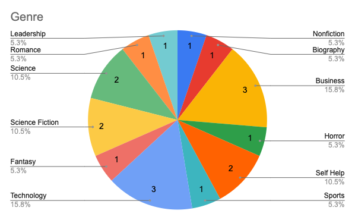
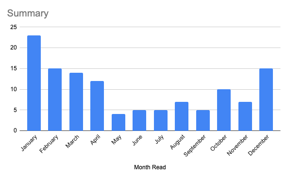
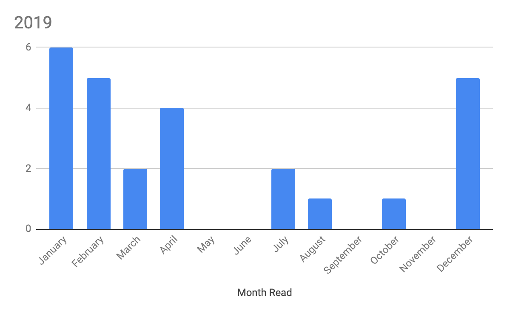
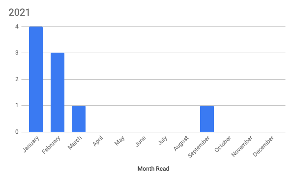
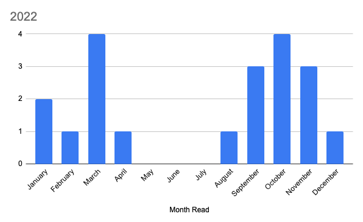

In 2022 I read [20 books](https://www.goodreads.com/review/list/7269489-adam?order=d&shelf=2022). This was 8 more than the goal I set in [2021](/posts/2021-review-of-the-books-i-read/) and the second-lowest number of books I’ve read since I started keeping track back in 2018 (you can find the list [here](/books)). I had originally set a goal of 12 books, a modest increase from the 9 that I read in 2021. A big reason for the increase was regaining a commute into the office in mid-2022 as well as a vacation without kids for the first time in several years. Having this dedicated time to read helped out.

## Favourite Books
### [How to Take Over the World: Practical Schemes and Scientific Solutions for the Aspiring Supervillain - Ryan North](https://www.goodreads.com/book/show/58446218-how-to-take-over-the-world) 
This was a really fun read. Ryan walks us through a lot of the science on how to take over the world as a supervillian. Most of the schemes would actually help improve the world. The sense of humour, fun facts and science really spoke to me. 

### [Technically Wrong: Sexist Apps, Biased Algorithms, and Other Threats of Toxic Tech - Sara Wachter-Boettcher](https://www.goodreads.com/book/show/38212110-technically-wrong) 
Honestly, if you work in tech or tech-adjacent this is a must read. Sara does a good job covering both the visible and invisible biases we have and how that impacts the technology that we build. There's a number of real-world examples that are used from the length of form fields for names, how default settings can be deceptive to certain groups of people and how AI/Big Data is built with our own biases and how that can impact people.

### [What If? Serious Scientific Answers to Absurd Hypothetical Questions - Randall Munroe](https://www.goodreads.com/book/show/21413662-what-if-serious-scientific-answers-to-absurd-hypothetical-questions) 
Another really easy read that had me laughing. I listened to this book but would suggest to others that you buy/borrow a physical copy so you can view all of comics that come with it. I also listened to the sequel, [What If? 2: Additional Serious Scientific Answers to Absurd Hypothetical Questions](https://www.goodreads.com/book/show/60190659-what-if-2) and highly recommend both

### [Becoming Bulletproof: Protect Yourself, Read People, Influence Situations, and Live Fearlessly - Evy Poumpouras](https://www.goodreads.com/book/show/49531236-becoming-bulletproof) 
I read this at the beginning of the year so my memory is a little iffy but it was a really interested read. It was part memoir with interesting stories of her experience as a secret service agent and part self help on how to handle your fears and protect yourself.

## Statistics

Last year I read/listened to 20 books. You can find the full list [here](https://www.goodreads.com/review/list/7269489-adam?shelf=2022). I listened to 17 audiobooks (at 1.5x speed) for a total of 92 hours of listening time (3.8 days). On average it took me 13.8 days to get through an audiobook vs 6.66 days to get through a hard copy. This was mainly because I only read 3 books and two were on vacation where I went through them in less than a day. Of the 3 physical books, I read a total of 1057 pages.

Of the 20 books, 5 were written by women (25%). This was a significant increase from last year (11%) but a decrease from 2020 and 2019 (40% and 35% respectively). My goal in 2023 is to bring this back up to 40%.

For the second year in a row, my average rating was below the average (4.00 vs 4.1435).

Technology and Business surpassed Science Fiction as my favourite genre for the first time.

## Five Year Summary 
2022 marks the fifth year of collecting statistics around my reading habits so I thought I'd do a rough summary of some of the data. In total I've read 122 books, broken out into 30 physical books, 89 audiobooks and 3 eBooks. I've read 7296 pages and listened for 21.28 days.

On average, it takes me 60 days to finish a book with the longest being 161 days and the shortest being finished in a single day. I read the most books in January and the least in May. This makes sense since I always start a new reading challenge at the beginning of the year. I think by the time spring comes I've burnt myself out.

## Onwards
I already have a couple of goals for 2023 and honestly, they're exactly the same as previous years. I want to continue being mindful of the books I’m reading and who’s writing them and I want to make sure that I’m reading books from a diverse set of authors. My goal is to read at least 40% of my books from female authors.

The second goal is to read at least 15 books. This is a slight increase from last year (12) but less than I ended up reading. As with last year, I want to be more consistent with the number of books I read in a month. I often get on a roll and then burn out. Basically, from 2019 onwards you can see when I burn myself out reading (generally April) and I don’t pick it up again until November when I realize I have a goal to hit.

Here’s to  [2023 and hopefully many more books](https://www.goodreads.com/review/list/7269489-adam?shelf=2023)!
