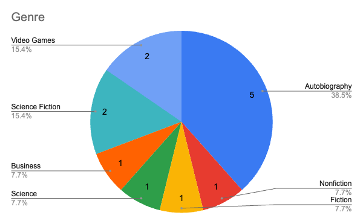
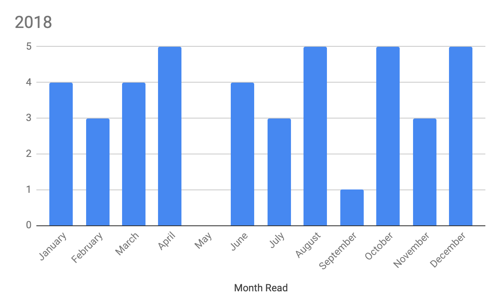
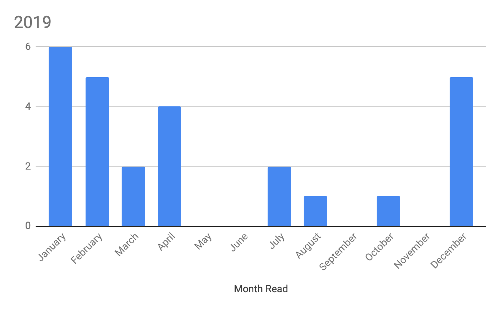
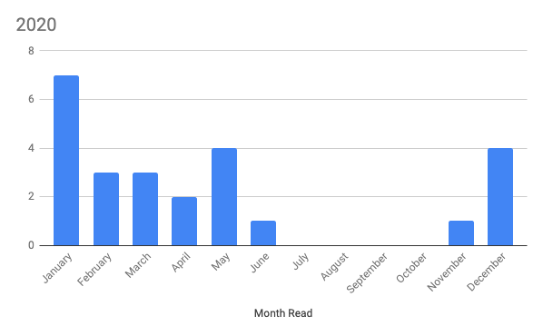
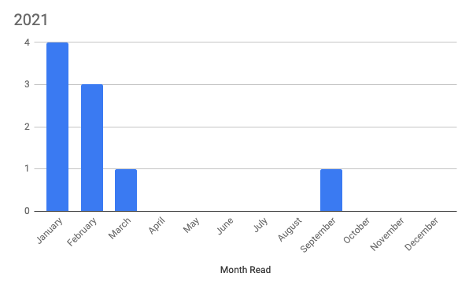
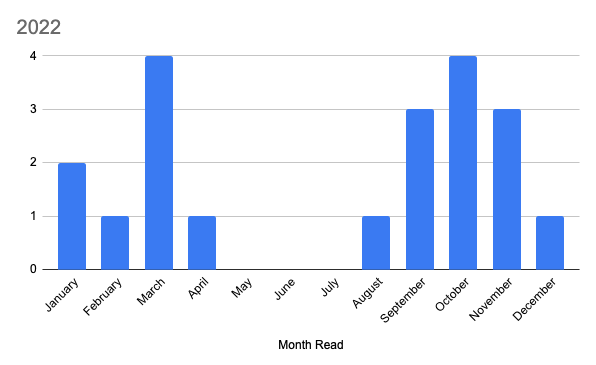
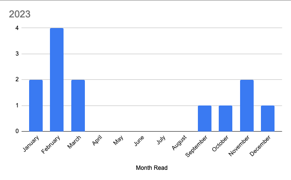

In 2023 I read [13 books](https://www.goodreads.com/review/list/7269489-adam?order=d&shelf=2023). This was 2 less than the goal I set in [2022](/posts/2022-review-of-the-books-i-read/) and the second-lowest number of books I’ve read since I started keeping track back in 2018 (you can find the list [here](/books)). I had originally set a goal of 15 books, a slight decrease from the 20 that I read in 2021. 2023 was another doozy of a year and I was severly burnt out for a lot of it. This meant that I missed the goal.

## Favourite Books

### [World War Z: An Oral History of the Zombie War – Max Brooks](https://www.goodreads.com/book/show/8908.World_War_Z)

I really enjoy all things zombies but surprisingly, had never gotten around to this book. I watched the movie "adaptaptation" and was so put off by it that I just never read it. The audiobook is fantastic with a number of great performances!

### [How to Invent Everything: A Survival Guide for the Stranded Time Traveler - Ryan North](https://www.goodreads.com/en/book/show/39026990)

Another fun and easy listen. I really enjoyed the unique nature of this book and the humour Ryan puts throughout it. There's a lot of science in this that I found really interesting as well.

## Statistics

Last year I read/listened to 13 books. You can find the full list [here](https://www.goodreads.com/review/list/7269489-adam?shelf=2023). I listened to 13 audiobooks (at 1.5x speed) for a total of 83 hours of listening time (3.5 days). On average it took me 13.1 days to get through an audiobooky. This is the first time since 2018 that I didn't read a single physical book. I think this is mainly due to the fact that I was burnt out and the barrier to entry for audiobooks is much less for me.

Of the 13 books, 3 were written by women (23%). This was a slight decrease from last year (25%). My goal in 2024 is to bring this back up to 40%.

For the first time in a while, my average rating was below the average (4.30 vs 4.04).

For the first time since I started keeping track, autobiographies topped the charts as my most read category. I only read three non-fiction books this year which is a significant decrease from past years.

## Onwards

I'm honestly not sure how long I'll keep this going. I've been struggling to find the motivation to read lately, pushing myself to hit specific numbers has often lead to me not wanting to read at all. For 2024 I've set a goal of 15 (again) but I want to spend more time just reading books I want to read vs trying to hit a specific number.

Here’s to [2024 and hopefully many more books](https://www.goodreads.com/review/list/7269489-adam?shelf=2024)!
