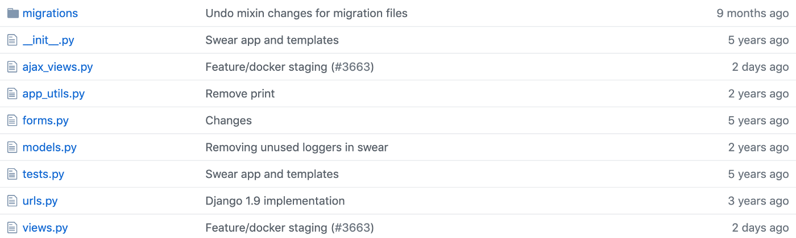
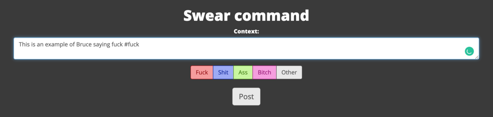
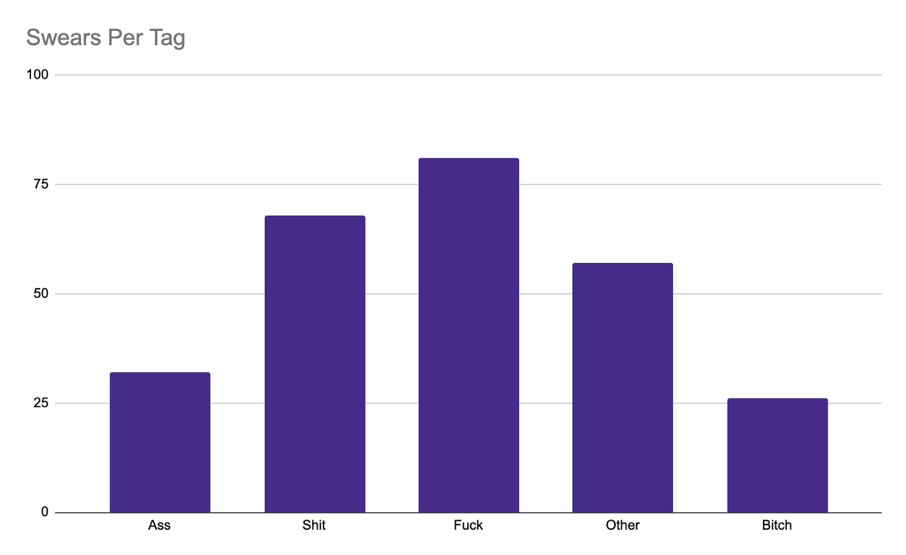
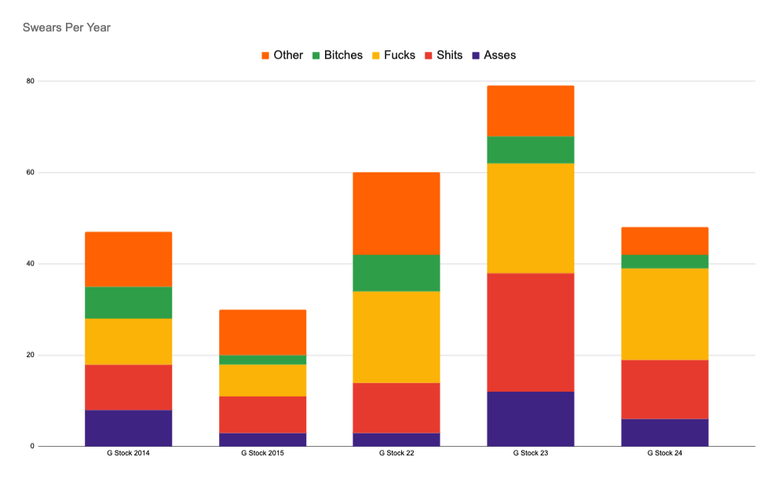

### Warning: This post contains NSFW language.

Every year in September over 300 staff from around the world come to Toronto for our annual conference, called G Stock. This is a week-long event that culminates in a keynote by our founder Bruce called The State of G Nation.

Back in 2010 when I started at G, I used to track casual curse words Bruce would drop at G Stock via Twitter. In 2014 we decided to [take it to eleven](https://www.youtube.com/watch?v=KOO5S4vxi0o) and build out a bespoke system to track it. This is a deep dive into the tech behind it and the data that’s been generated over the past five years.


## The Tech
The technology behind tracking this is extremely simple. We have a Django app that keeps track of every time Bruce swears, a simple javascript frontend that polls for any new events and a simple admin interface where certain people can post new swears.



As you can see above, we’ve split the app into a few different sections, the most important ones being `models`, `views` and `ajax_views`. This application follows our standard layout where we like to split up ajax views with regular views. For larger applications this keeps things nice and tidy, in the case of the Swear app it’s overkill.

Our models are extremely simple:
```
SWEAR_TYPES = (
    (FUCK, 'Fuck'),
    (BITCH, 'Bitch'),
    (SHIT, 'Shit'),
    (ASS, 'Ass'),
    (OTHER, 'Other')
)

SWEAR_EVENT_TYPES = {
    (0, 'G Stock'),
    (1, 'Town Hall')
}


class SwearEvent(models.Model):
    title = models.TextField(null=False)
    stinger = models.TextField(null=True)
    event_type = models.IntegerField(choices=SWEAR_EVENT_TYPES, default=0)
    created = models.DateTimeField(auto_now_add=True)


class Swear(models.Model):
    text = models.TextField(null=True)
    event = models.ForeignKey(SwearEvent, related_name='swears', null=True)
    updated = models.DateTimeField(auto_now=True)
    created = models.DateTimeField(auto_now_add=True)


class Tag(models.Model):
    swear = models.ForeignKey(Swear, related_name='tags')
    swear_type = models.IntegerField(choices=SWEAR_TYPES)
    created = models.DateTimeField(auto_now_add=True)
```

As you can see, the models are really simple. At the core, we have a `SwearEvent` that stores the details of each G Stock and a `Swear` model that stores the details of each swear. One thing to keep in mind is that this was initially created back in 2015 and has changed little over the years. If I was writing this today I wouldn’t have a separate model for Tags, instead, I’d store it as a `ArrayField`.


Next up we’ll look at the views file. As mentioned above, this could easily be in a single `views.py` file due to the size.

```
#ajax_views.py
class AjaxFeed(JSONResponseMixin, AjaxResponseMixin, View):
    def get_ajax(self, request, *args, **kwargs):
        context = {'posts': []}
        event = SwearEvent.objects.all().order_by('-created').first()
        context['totals'] = get_totals_dict(event)
        
        try:
            last_swear = Swear.objects.get(id=request.GET.get('id'))
        except Swear.DoesNotExist:
            if not event.swears.all().exists():
                context['no_swear'] = True
                return self.render_json_response(context)
            else:
                last_swear = None
        
        if not last_swear:
            swearios = event.swears.all().order_by('-created')
        else:
            swearios = event.swears.filter(created__gt=last_swear.created).order_by('-created')

        for swear in swearios:
            context['posts'].append({
                'id': swear.id,
                'created': swear.created.strftime("%b %d, %Y, %I:%M %p"),
                'text': swear.text,
                'swear_types': [str(tag) for tag in swear.tags.all()],
            })

        return self.render_json_response(context)

#views.py
class SwearView(TemplateView):
    template_name = "swear/swear.html"

    def get(self, request, *args, **kwargs):
        context = self.get_context_data()
        event = SwearEvent.objects.all().order_by('-created').first()
        high_score = SwearEvent.objects.filter(event_type=event.event_type).exclude(id=event.id).annotate(count=Count('swears__tags')).order_by('-count').first()
        swears = Swear.objects.filter(event=event).order_by('-created')
        first_id = swears.first().id if swears.first() else 0
        context['totals'] = get_totals_dict(event)
        context['last_year'] = get_totals_dict(high_score)
        context.update({
            'last_id': first_id,
            'event': event,
            'high_score': high_score,
        })
        context.update({'swears': swears})

        return self.render_to_response(context)

class SwearAdminView(TemplateView):
    template_name = "swear/admin.html"

    def get(self, request, *args, **kwargs):
        context = self.get_context_data()

        event = SwearEvent.objects.all().order_by('-created').first()
        context.update({
            'event': event,
        })

        if not request.user.is_superuser:
            raise Http404

        return self.render_to_response(context)

    def post(self, request, *args, **kwargs):
        context = self.get_context_data()
        event = SwearEvent.objects.all().order_by('-created').first()
        text = request.POST.get('text')
        text_tags = text.split("#")
        # first item is the text, the rest are tags
        # This is gross but here we are
        text = text_tags.pop(0)

        swear = Swear.objects.create(event=event, text=text.strip())
        text_tags = [text.strip() for text in text_tags]
        for index, tag in SWEAR_TYPES:
            if tag in text_tags:
                t = Tag.objects.create(swear=swear, swear_type=index)

        update_slack(swear)

        context.update({
            'event': event,
            'success': True,
            'swear_types': [str(tag) for tag in swear.tags.all()],
            'text': swear.text,
        })

        return self.render_to_response(context)
```
The views in `views.py` are fairly standard. `SwearView` loads up the homepage seen above. It pulls in the latest event (we only ever have one going at any given time), finds the event with the highest amount of swears and then creates the context to pass into the homepage. One thing you’ll see across the views is us passing in `last_id` to the context. This is how the frontend polls for newly created swears.

`SwearAdminView` creates the admin view where certain users can manually type in swears as Bruce says them. The `get` function is extremely simple, just setting the context to the latest event. The `post` function pulls in the event and text for the swear, splits on each hash to find all of the swear tags, creates the swear event and then posts to Slack.



In `ajax_views.py` we have a single class that takes in the latest swear ID (as set in the initial load) and then finds all of the swears that have been created since. It then adds that information to the context so the javascript app can display it.

That pretty much wraps up the technical side of things. Now we can dive into some data.

## The Data
On average, Bruce swears 53 times per keynote. In 2016, we started raising money for [Planeterra](https://planeterra.org/) based on the number of curses, and since then there has been an upward trend in the number of swears per year. Perhaps Bruce realizes this? So far we’ve raised over $2500 with over $500 already pledged this year.


Bruce really loves to say Fuck, as it brings in the dollars. We’ll dig into the trends of each swear type over the years but overall Fucks and Shits are trending upwards. We define Other swears as anything that doesn’t fit into a different tag or is a negative sentence towards a specific Region or Department at G Adventures. An example of an Other is `What the hell have I created in this company`?



On average there’s 45 per hour in the morning and only 21 per hour in the afternoon. It seems like Bruce loses steam as the day goes on. The lowest amount of swears come at 1 pm. This is primarily due to lunch (which is normally 12:45–1:30 pm) and Bruce no longer being [hangry](https://www.merriam-webster.com/dictionary/hangry). There are also fewer opportunities to swear in the afternoon because that’s when we present awards and have other people speak.


Next up we’ll look at some trends for each of the swears. `G Stock 23` is obviously an outlier since it had the most swear words by almost 30%. Fucks and Shits are definitely on the rise. Year over year Bruce tends to lean towards these more than any other. Other and Bitches are trending downwards, especially when you consider `G Stock 23`. Asses have been pretty flat overall.



And that’s a deeper look into the tech that powers G Stock’s swear counter and a look into the trends of how Bruce has sworn over the years. G Stock 25 is happening this month and I’m excited to see if he’ll set a new record.