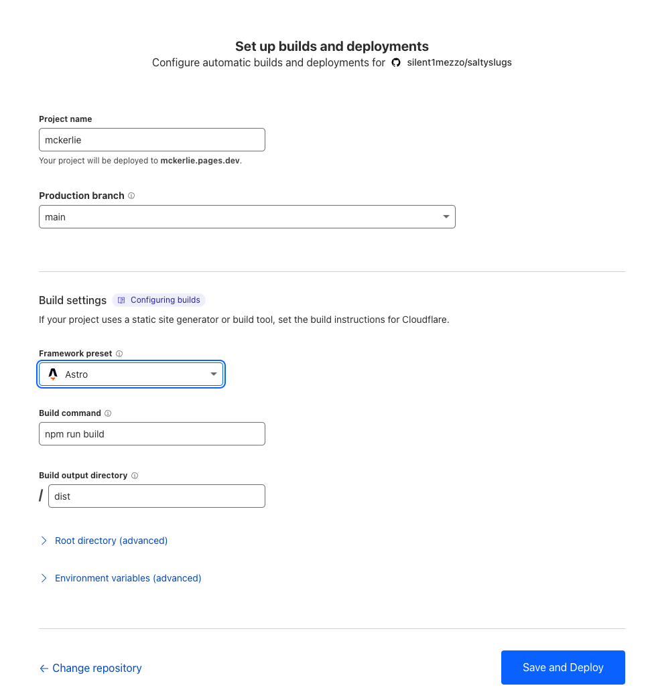

If there's one common trait I've seen between engineers it's the constant desire to tinker and improve. Last year I move this site from [Hugo to Astro](/posts/migrating-your-blog-from-hugo-to-astro/) purely because I wanted to try a new framework. This year I decided to move from hosting it with Vercel to Cloudflare. I was getting more and more concerned about the [billing horror stories](https://x.com/zemotion/status/1798558292681343039) and while Vercel's UX is amazing I knew I'd never need all of the extra features. For the last number of years I've used Cloudflare to mitigate DDoS attacks but I've never hosted an entire site and I was excited to try it out. As an added bonus, it also meant that I got to use [counterscale](https://github.com/benvinegar/counterscale) as a free self-hosted analytics provider.

Here's a super quick look into how I moved a number of sites over without any downtime.

## Migrating

For me, the basic path for any hosting migration is to first get the site working on the new provider, test it out, switch DNS and finally remove it from the previous hosting provider. This allows you to make sure things are working properly and gives you a path to revert quickly if you need to.

### Setting up Cloudflare

Now, just to be totally transparent, I have no idea what I'm doing half of the time. There could be an easier way to do this or a better way to configure your website but this is what worked best for me.

#### Setting up Cloudflare Pages

The first thing I did was set up a new [Cloudflare Page](https://pages.cloudflare.com/) and connect it with my [github repo](https://github.com/silent1mezzo/mckerlie.com).

This brings you to a process to set up how your site builds and gets deployed. It felt very similar to the process when I first set up Vercel

Once you click `Save and Deploy` Cloudflare will go through the process of cloning, building and deploying your website to the pages.dev URL mentioned under the project name.

#### Custom Domain and DNS changes

Next up is attaching your domain to your newly create page.

### Testing

Once you've got your page up and running, the custom domain attached you can quickly verify that everything's working. For this you can run `whois <site>` on any unix based machine or visit [icann.org's lookup page](https://lookup.icann.org/en/lookup). What you're looking for is to see that the nameservers now point to Cloudflare. Once they do and you check to see the site is still up and working you're finished!

## Wrapping things up

Now that everything has been set up properly in Cloudflare, I've tested it out and switched DNS I just had to come back into Vercel and delete all of the projects.

Overall I'm really happy with Cloudflare so far. The UX leaves a lot to be desired but the ease of getting everything set up, the speed at which it serves my static content and the generous free plan all help me sleep better at night.

If you’re interested in more technical details or have any questions about the migration process, feel free to reach out.
