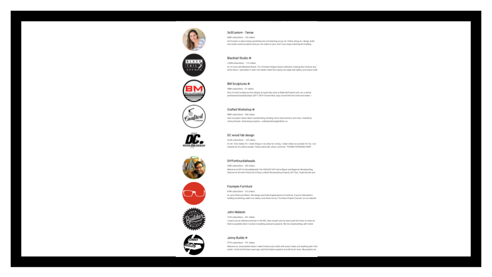
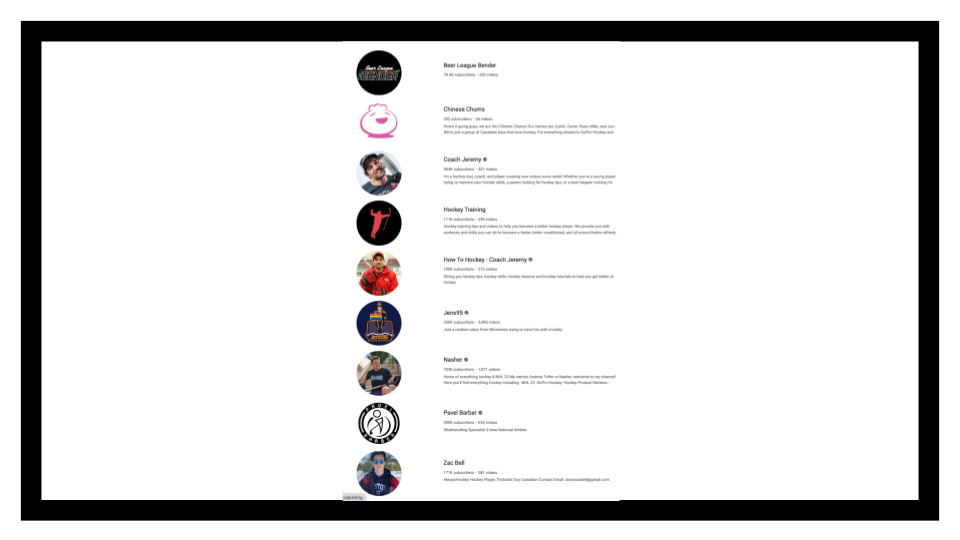
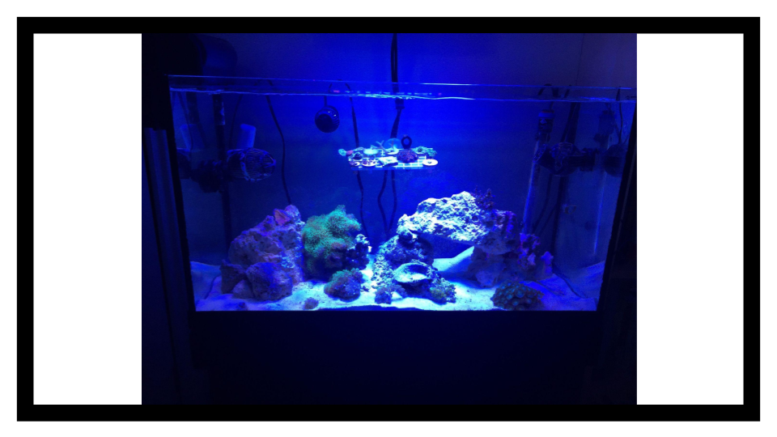
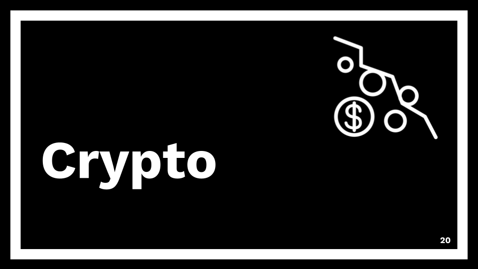
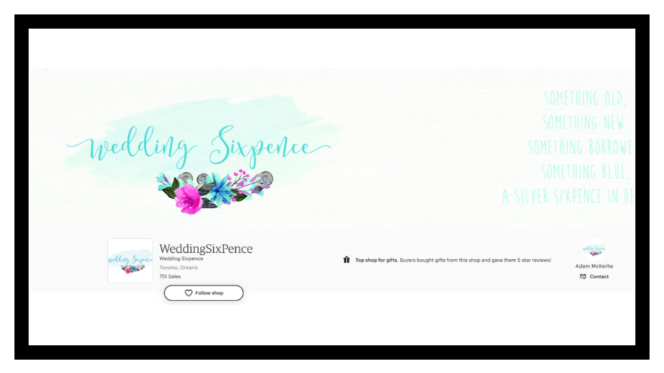
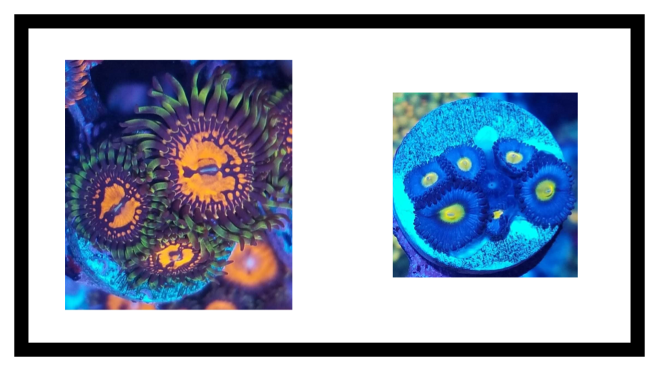

import { YouTube } from '@astro-community/astro-embed-youtube';

Last year at the Sentry Toronto Office (ps, [we're always hiring](https://sentry.io/careers/)!) we started a new tradition of presenting lightning talks in front of the office. A lightning talk can be on any topic you wish. Since we're a tech company, some talks are technically focused but the only rule is that they're less than 5 minutes. This helps people improve their presentation skills, work on talking in front of a large group and craft talks for conferences or other reasons in a safe place. It's also a great opportunity to create silly, fun talks which is exactly what I did. 

Here's the lightning talk I gave on how (not) to start a new hobby. The tone of this post will be much more conversational since that's the style of how I present. I'll present each slide and then the talk track underneath it.

### Talk
<YouTube id="TDsCMTRlhvI" />

### Slides

So welcome everyone. Thank you for joining us here today. Today I'm gonna talk to you about how to st if you wanna start a new hobby, how you could do that.

For those that don't know, my name is Adam and I have been told that my hobby is starting new hobbies. 
So I thought I would walk you through some of the ways that you could start a new hobby as well as showcase some of the hobbies that I have had in the past.
 

First thing that you should do when starting a new hobby is you should research it to death. You never know when a nugget of information is going to be useful and honestly, like why actually do something when you can just read about it.

So some of the cases where I've done this last year, I spent a lot of time researching drones and did you know that if your drone is under 250 grams, you actually don't need to register it. Also, you can't fly it more than 400 feet in the air and if you fly it within a hundred feet measured horizontally, you actually need to get a special pilot certificate.  I know that because many weeks [were spent researching it].

When Brent built the meeting room signs for hack week, I went home and started researching 3D printers and I thought it would be fun to get one. There are three main types. There's fusion deposition modeling, printers, FDM, stereolithography, printers, SLA and stereo, laser centering, SLS. The first two are the most popular because we can afford them. Stereo, laser centering, way too expensive.

The next thing that you should do is subscribe to every YouTube channel possible. It's similar to researching, but really you need to get that content in.

So here is page one of 10 of aquarium channels that I've subscribed to and I got really into reef tanks...

and woodworking...

and hockey...

And I, you get the point and, and you may even get to, you may even wanna start your own YouTube channel at one point.

All right, so you've done the research, you've watched everything that there is to know about the hobby. It's time to jump into the deep end and spend all of your money on it.

You could start a coin collection and this is approximately one 50th of my coin collection by weight. I was not allowed to take all of it out for obvious purposes.

You could buy all of the tools that the YouTube channel recommends and build a workbench...

and a mallet.

Or you could start a reef tank at the office.

And at home...

and then let that tank crash because you had a kid wait five years and start up another one.

You spent all the money. Now it's time to recoup some of the costs so you can turn your business or your hobby into a business.

Every talk needs to be about crypto. So in 2014, I bought dogecoin by connecting my bank account to a super sketchy marketplace and then reselling it on eBay. I bought about 200,000 coins for about 50 bucks, flipped it for 600. If I just waited to the all time high instead of selling, it would've been worth about $140,000. Excellent.

You could also go on fiverr, pay some money to have a design and a logo made open an Etsy shop and sell those coins from that coin collection. And I did this, I had about 750 orders, about a thousand coins that I sold.

Or you could take that coral that you grew, package it up in little biggies, meet people at the local Tim Hortons and exchange your goods for cash. And speaking of putting things in bags and selling them...

You can also start a tea company. And as I was building these slides, I realized that most of my hobbies end up with me just buying things in bulk, cutting them, repackaging them, and selling them for a markup. So moving on...

Finally, once you've done all of that, you've researched it, you've spent your money and you've turned into a business, you can get bored and move on to the next thing.

But make sure that you keep your coins in a protected space

and that you put everything back neatly so you can find it the next time.

And then I didn't have a segue to this. So in 2019, I ran a bunch for a half marathon and then I never did it again. And of course I subscribed to all of the YouTube running channels and bought all brand new gear and then finally rinse and repeat every six months.

 And that is how you start a new hobby. Thank you.

I forgot to actually show this slide in the lightning talk but I would have just read off it.

