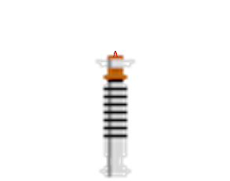
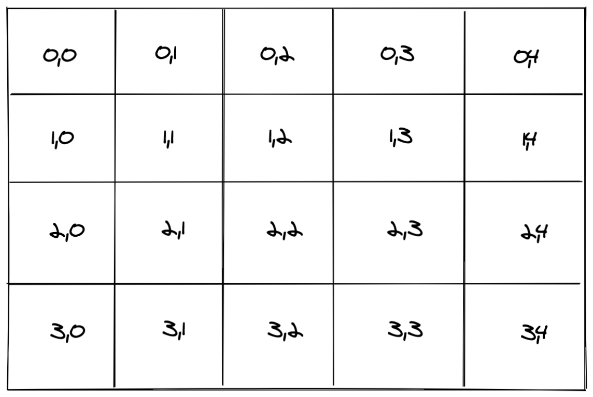
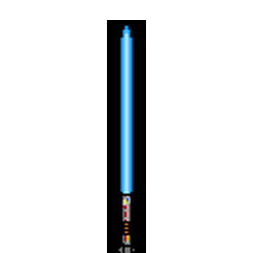
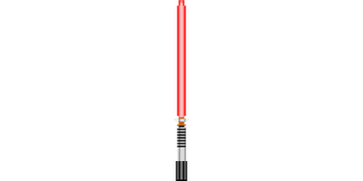
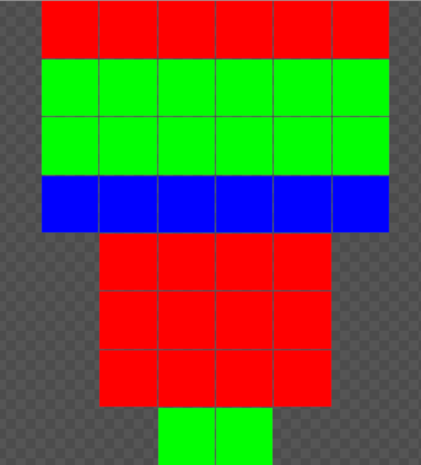
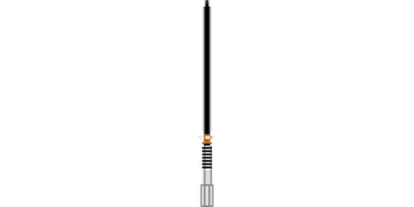

Python is great for a number of things. It powers [1.4% of the internet](https://w3techs.com/technologies/details/pl-python), [Nasa uses it a lot!](https://code.nasa.gov/?q=python) and you can use it to [create art](https://simpleprogrammer.com/python-generative-art-math/). In honour of [Star Wars Day](https://en.m.wikipedia.org/wiki/Star_Wars_Day), I wanted to create a program that dynamically generated lightsabers and tweeted them out once a day.

## TL;DR
I created a computer program that generates a unique lightsaber made out of four different parts (blade, hilt, pommel and button) and [tweets it out](https://twitter.com/dailylightsaber/status/1252351344834297860) once a day along with some statistics about the lightsaber.

*Luke briefly had a red lightsaber*

## Getting Started
The overall premise of this script is fairly simple. It randomly selects four pieces of a lightsaber and then pieces them together. To achieve this I used an online tool called [Piskel](https://www.piskelapp.com/) to generate all of the 8-bit parts. While Piskel is normally used to create animated sprites for websites it’s one of the better 8-bit art editors. My favourite feature from it is the ability to mirror lines. This simplifies the process of making symmetrical lightsabers.

Once I created a base set of parts put them in an images directory. This directory has 5 folders, one for each part and an output folder (lightsabers). This allows me to keep everything organized as well as helps later on when generating lightsabers.

```
images/
    blades/
        b1.png
        b2.png
    hilts/
        h1.png
        h2.png
    buttons/
        u1.png
    pommels/
        p1.png
    lightsabers/
        h1b2u1p1.png
```

To do all of this I installed three python packages. I use [Pillow](https://pypi.org/project/Pillow/) (version 7.1.1) for all of the image processing, [Tweepy](https://pypi.org/project/tweepy/) (version 3.8.0) to send out the tweets and numpy (version 1.18.3) to do some colour processing that I’ll discuss later on. Overall it’s a very simple requirements.txt

```
# requirements.txt
numpy==1.18.3
Pillow==7.1.1
tweepy==3.8.0
```

The first version of this script was really this simple. Call generate_lightsaber and that’s it. Up next I’ll talk about how I generated the [initial lightsaber](/posts/using-python-to-generate-10000-unique-lightsabers/#adding-blades-and-hilts) (just the blade and hilt), then how I added [buttons](/posts/using-python-to-generate-10000-unique-lightsabers/#adding-buttons) and [pommels](/posts/using-python-to-generate-10000-unique-lightsabers/#adding-pommels) and finally how I [tweeted the final image](/posts/using-python-to-generate-10000-unique-lightsabers/#generating-random-tweet-text).

```
# lightsaber.py
import os, random
from pathlib import Path, PurePath
# This is actually Pillow but it's API is backwards compatible with the older PIL
from PIL import Image

def generate_lightsaber():
    # Will talk about this more next

if __name__ == "__main__":
    generate_lightsaber()
```

## Adding Blades and Hilts
In my initial design, I only had blades and hilts so that’s where I started. My first goal was to get a single blade and a single hilt merged and properly lined up on a single image. I first added code to fetch a unique lightsaber part based on the directory layout above.

```
# lightsaber.py
# Set some constants to keep the code clean and consistent
IMAGE_PATH = Path('../images')
BLADE_PATH = IMAGE_PATH / 'blades'
HILT_PATH = IMAGE_PATH / 'hilts'
OUTPUT_PATH = IMAGE_PATH / 'lightsabers'

def fetch_lightsaber_parts():
    hilt = Path(f"{HILT_PATH}/{random.choice(os.listdir(HILT_PATH))}")
    blade = Path(f"{BLADE_PATH}/{random.choice(os.listdir(BLADE_PATH))}")

    return (hilt, blade)
```

First, we have `os.listdir()`, which returns a list of filenames in the directory given. The list is in arbitrary order and it does not include the special entries ‘.’ and ‘..’ even if they are present in the directory. It does, however, include any folders or special files (like .DS_store in OS X) so make sure your folder only includes the image files. We pass that filename into `random.choice` which will choose a random filename. Finally, we create the full file path and return that for both the hilt and the blade.

Once we’ve gotten the image paths we can start piecing them together into a final image.

```
# lightsaber.py
def generate_lightsaber():
    blade_path, hilt_path = fetch_lightsaber_parts()

    # Open the images using Pillow
    blade = Image.open(blade_path, 'r')
    hilt = Image.open(hilt_path, 'r')

    # Open the output image. Twitter displays the entire image if it's 1024x512
    output = Image.new("RGB", (1024, 512), (255, 255, 255))

    # Paste the blade and hilt onto the output image. 
    output.paste(blade, blade_offset, mask=blade)
    output.paste(hilt, hilt_offset, mask=hilt)

    # Save the output image to disk
    img.save("{}/{}.png".format(OUTPUT_PATH, output_filename))
```

irst, we’ll fetch the paths as described above. After that, we’ll use Pillow to open the images as well as create a new output image with the width and height specified by Twitter to allow us to show the entire image as a preview. Finally we paste the two original images and save the output.

When pasting the images onto the output you’ll see two arguments that I haven’t shown yet, `<part>_offset` and `mask`. The offset is used to determine where the parts are placed on the output image. When you get this wrong, funny things can happen.

*The tiniest of blades*

To calculate the offset, where the image gets placed, I need to get and store all of the dimensions of the images. Then we calculate the middle position for the width `(output_w - blade_w) // 2` this aligns it horizontally on the image. This is true for both the blade and the hilt.

To position the blade and hilt vertically it requires a little more math. For the hilt, we take the height of the output image (512px) and subtract the height of the hilt image (between 70 and 120px depending on the design). This makes the hilt start at the bottom of the image.

```
# lightsaber.py
output_w, output_h = output.size
blade_w, blade_h = blade.size
hilt_w, hilt_h = hilt.size

blade_offset = ((output_h - blade_h - hilt_h + hilt_offset), (output_w - blade_w) // 2)
hilt_offset = (output_h - hilt_h, (output_w - hilt_w) // 2)
```

*You can think of the image like an array*

Using the array above as an example, if we had a lightsaber 1px wide and 2px (1px hilt, 1px blade) tall the math would be.

```
blade_offset = ((4 - 1 - 1), (5 - 1) // 2 ) # (2, 2)
hilt_offset = ((4 - 1), (5 - 1) // 2) # (3, 2)
```


Finally, we have to pass in the original image as a mask, otherwise, Pillow will default the transparent backgrounds into black. By using a mask Pillow only writes data to the output image for the pixels that have colour. The image below on the left has a mask applied, the one on the right does not.




## Adding Hilt Offsets and Extra Information
When calculating the blade offset you may have noticed a variable `hilt_offset`. In some designs, the part where the blade comes out of the hilt isn’t the start of the lightsaber. In these cases I needed the blade to start “below” where the hilt starts. Knowing that I needed to do this but also store metadata on hilts, blades, buttons and pommels down the road I created a manifest.py file to store these defaults.

```
# manifest.py
MANIFEST = {
    "hilt": {
        "h1": {
            "offsets": {
                "blade": 5
            }
        }
    }
}
```

```
# lightsaber.py
from manifest import MANIFEST

def get_hilt_offset(hilt):
    return MANIFEST['hilt'][hilt]['offsets']['blade']

def generate_lightsaber():
    ...
    hilt_offset = get_hilt_offset(hilt)
    blade_offset = ((output_h - blade_h - hilt_h + hilt_offset), (output_w - blade_w) // 2)
```

Without this offset, I was originally getting a floating blade for certain designs. You can see below that the bottom of the blade lines up with the top of the rightmost side of the lightsaber but it still looks funny.

*The force must be keeping this thing together*

This manifest file also holds information on button offsets, colours and tweet information but I’ll go more in-depth into that later on.

## Adding Buttons
After getting the blades and hilts lined up I realized that to hit 10,000 unique lightsabers with only blades and hilts I would need to design 100 of each (200 total). My 8-bit art skills just aren’t up to that. By adding buttons I could cut down the unique designs needed only 22 each (66 total). Buttons were added to the final image in exactly the same way as hilts and blades.

```
# lightsaber.py
# Set some constants to keep the code clean and consistent
IMAGE_PATH = Path('../images')
BLADE_PATH = IMAGE_PATH / 'blades'
HILT_PATH = IMAGE_PATH / 'hilts'
BUTTON_PATH = IMAGE_PATH / 'buttons'
OUTPUT_PATH = IMAGE_PATH / 'lightsabers'

def fetch_lightsaber_parts():
    hilt = Path(f"{HILT_PATH}/{random.choice(os.listdir(HILT_PATH))}")
    blade = Path(f"{BLADE_PATH}/{random.choice(os.listdir(BLADE_PATH))}")
    button = Path(f"{BUTTON_PATH}/{random.choice(os.listdir(BUTTON_PATH))}")

    return (hilt, blade, button)

def generate_lightsaber():
    blade_path, hilt_path, button_path = fetch_lightsaber_parts()

    # Open the images using Pillow
    blade = Image.open(blade_path, 'r')
    hilt = Image.open(hilt_path, 'r')
    button = Image.open(button_path, 'r')

    # Open the output image. Twitter displays the entire image if it's 1024x512
    output = Image.new("RGB", (1024, 512), (255, 255, 255))

    output_w, output_h = output.size
    blade_w, blade_h = blade.size
    hilt_w, hilt_h = hilt.size
    button_w, button_h = button.size

    hilt_offset = get_hilt_offset(hilt)
    blade_offset = ((output_h - blade_h - hilt_h + hilt_offset), (output_w - blade_w) // 2)
    hilt_offset = (output_h - hilt_h, (output_w - hilt_w) // 2)

    # Paste the blade and hilt onto the output image. 
    output.paste(blade, blade_offset, mask=blade)
    output.paste(hilt, hilt_offset, mask=hilt)
    output.paste(button, get_button_offset(hilt), mask=button)

    # Save the output image to disk
    img.save("{}/{}.png".format(OUTPUT_PATH, output_filename))
```

The main complication with buttons is that they can be placed in a square on the hilt and this square is different for each hilt. There are a few different ways we could do this automatically (detect edges, detect width and height of the blade, etc…) but for simplicity’s sake, I just decided to manually calculate it for each hilt and store it in the manifest file.

```
# manifest.py
"hilt": {
    "h1": {
        "offsets": {
            "blade": 0,
            "button": {
                "x": (8, 9),
                "y": (110, 111)
            },
        },
    },
}

# lightsaber.py
def get_button_offset(hilt):
    between_x = MANIFEST['hilt'][hilt]['offsets']['button']['x']
    between_y = MANIFEST['hilt'][hilt]['offsets']['button']['y']

    return (random.randint(between_x[0], between_x[1]), random.randint(between_y[0], between_y[1]))
```

## Adding Pommels
Once again, pommels were added to the image in much the same way as the others only this time I needed to update the height of both the blade and the hilt to accommodate the pommel. This didn’t go well at first.

*This is what happens when you get your +’s and -‘s mixed up*

```
# lightsaber.py
# Set some constants to keep the code clean and consistent
IMAGE_PATH = Path('../images')
BLADE_PATH = IMAGE_PATH / 'blades'
HILT_PATH = IMAGE_PATH / 'hilts'
BUTTON_PATH = IMAGE_PATH / 'buttons'
POMMEL_PATH = IMAGE_PATH / 'pommels'
OUTPUT_PATH = IMAGE_PATH / 'lightsabers'

def fetch_lightsaber_parts():
    hilt = Path(f"{HILT_PATH}/{random.choice(os.listdir(HILT_PATH))}")
    blade = Path(f"{BLADE_PATH}/{random.choice(os.listdir(BLADE_PATH))}")
    button = Path(f"{BUTTON_PATH}/{random.choice(os.listdir(BUTTON_PATH))}")
    pommel = Path(f"{POMMEL_PATH}/{random.choice(os.listdir(POMMEL_PATH))}")

    return (hilt, blade, button, pommel)

def generate_lightsaber():
    blade_path, hilt_path, button_path, pommel_path = fetch_lightsaber_parts()

    # Open the images using Pillow
    blade = Image.open(blade_path, 'r')
    hilt = Image.open(hilt_path, 'r')
    button = Image.open(button_path, 'r')
    pommel = Image.open(pommel_path, 'r')

    # Open the output image. Twitter displays the entire image if it's 1024x512
    output = Image.new("RGB", (1024, 512), (255, 255, 255))

    output_w, output_h = output.size
    blade_w, blade_h = blade.size
    hilt_w, hilt_h = hilt.size
    button_w, button_h = button.size
    pommel_w, pommel_h = pommel.size

    pommel_offset = pommel_h
    hilt_offset = get_hilt_offset(hilt_name) - pommel_offset
    button_offset = get_button_offset(hilt_name)  

    blade_offset = ((output_h - blade_h - hilt_h + hilt_offset), (output_w - blade_w) // 2)
    hilt_offset = (output_h - hilt_h - pommel_offset, (output_w - hilt_w) // 2)
    pommel_offset = (output_h - pommel_h, (output_w - pommel_w) // 2)

    # Paste the blade and hilt onto the output image. 
    output.paste(blade, blade_offset, mask=blade)
    output.paste(hilt, hilt_offset, mask=hilt)
    output.paste(button, get_button_offset(hilt), mask=button)

    # Save the output image to disk
    img.save("{}/{}.png".format(OUTPUT_PATH, output_filename))
```

The next challenge I encountered with pommels was designing them so they looked nice across all hilts. When I first designed the lightsaber I included both the hilt and the pommel. When I realized I needed to split them out to allow for more unique combinations I simply cut the old 8-bit images in two. The problem with this is that the colour schemes between hilts and pommels just didn’t match.




After a lot of thinking I decided that I could do something similar to how green screens work. If I designed the images with specific colours (in this case Red = Primary, Blue = Secondary and Green = Tertiary) I could pull them out using Pillow and Numpy and substitute them for the colours I want.



```
# manifest.py
"hilt": {
    "h1": {
        "offsets": {
            "blade": 0,
            "button": {
                "x": (8, 9),
                "y": (110, 111)
            },
        },
        "colours": {
            "primary": (216,216,216), #d8d8d8
            "secondary": (141,141,141), #8d8d8d
            "tertiary": (180, 97, 19), #b46113
        },
    },
}

# lightsaber.py
import numpy as np

def convert_colours(img, hilt):
    img = img.convert('RGBA')
    data = np.array(img)

    # Grab the pixels which are 100% red, 100% blue and 100% green
    red, green, blue, alpha = data.T
    primary = (red == 255) & (blue == 0) & (green == 0)
    secondary = (red == 0) & (blue == 255) & (green == 0)
    tertiary = (red == 0) & (blue == 0) & (green == 255)

    # Substitute out the colours for the hilt colour scheme
    data[..., :-1][primary.T] = MANIFEST['hilt'][hilt_name]['colours']['primary']
    data[..., :-1][secondary.T] = MANIFEST['hilt'][hilt_name]['colours']['secondary']
    data[..., :-1][tertiary.T] = MANIFEST['hilt'][hilt_name]['colours']['tertiary']

    return Image.fromarray(data)

def generate_lightsaber():
    ... 
    pommel = Image.open(pommel_path, 'r')
    pommel = convert_colours(pommel, hilt_name)
    ...
```

Once I did that everything was all set. The pommels now have the correct colour scheme as the lightsaber.





## Generating Random Tweet Text
The final part of all of this is generating the actual tweet. I added a number of fields to the manifest file including the hilt length and material, the blade colour, crystal and who used it and finally the pommel length. After that a new function, `generate_tweet_text`, that pulls all of this new information together and generates the text to tweet out.

```
# manifest.py
"hilt": {
    "h1": {
        "offsets": {
            "blade": 0,
            "button": {
                "x": (8, 9),
                "y": (110, 111)
            },
        },
        "colours": {
            "primary": (216,216,216), #d8d8d8
            "secondary": (141,141,141), #8d8d8d
            "tertiary": (180, 97, 19), #b46113
        },
        "length": 24,
        "materials": "Alloy metal/Salvaged materials"
    },
},
"blade": {
    "b1": {
        "colour": "Red",
        "crystal": ["Ilum crystal", "Ultima Pearl"],
        "type": "Sith"
    },
},
"pommel": {
    "p1": {
        "length": 5,
    },
}

# lightsaber.py
AVERAGE_HILT_LENGTH = 25
AVERAGE_POMMEL_LENGTH = 3
AVERAGE_BLADE_LENGTH = 90

NAMES = ['List', 'of', 'generated', 'names']

def generate_tweet_text(hilt, blade, pommel):
    hilt_details = MANIFEST['hilt'][hilt]
    blade_details = MANIFEST['blade'][blade]
    pommel_details = MANIFEST['pommel'][pommel]

    hilt_length = hilt_details['length']
    pommel_length = pommel_details['length']

    total_length = hilt_length + pommel_length
    average_length = AVERAGE_HILT_LENGTH + AVERAGE_POMMEL_LENGTH
    blade_length = int(AVERAGE_BLADE_LENGTH * (total_length / average_length))

    title = blade_details['type']
    if type(title) is list:
        title = random.choice(title)

    crystal = MANIFEST['blade'][blade]['crystal']
    if type(crystal) is list:
        crystal = random.choice(crystal)

    name = f"{title} {random.choice(NAMES)}"

    tweet = f'''Owner: {name}
Hilt Length: {total_length} cm
Blade Length: {blade_length} cm
Blade Colour: {MANIFEST['blade'][blade]['colour']}
Kyber Crystal: {crystal}

#StarWars
'''

    return tweet
```

To generate the unique names I used this  [Star Wars name generator](https://www.dimfuture.net/starwars/random/generate.php)  to generate a number of names. I then randomly choose one to use.

To tweet out the final tweet I use the python library  [Tweepy](https://www.tweepy.org/)  to do all of the heavy lifting for me. Since I already have the image saved on file all I need to do is grab the credentials from an environment variable, upload the media and then post the tweet.

```
consumer_key = os.getenv('CONSUMER_KEY')
consumer_secret = os.getenv('CONSUMER_SECRET')

access_token = os.getenv('ACCESS_TOKEN')
access_token_secret = os.getenv('ACCESS_TOKEN_SECRET')

auth = tweepy.OAuthHandler(consumer_key, consumer_secret)
auth.set_access_token(access_token, access_token_secret)
api = tweepy.API(auth)

tweet_text = generate_tweet_text(hilt, blade, pommel)

media = api.media_upload(path)
api.update_status(status=tweet_text, media_ids=[media.media_id,])
```

If this is your first time setting up a twitter bot you’ll need to  [create an application first](https://developer.twitter.com/apps) , grab your credentials and then store them in an environment variable.

## Wrapping it all up
Now that everything’s running correctly, I’ve got it generating a unique lightsaber and posting it to Twitter I just have to  [add it to a Cron](/posts/adding-cron-to-a-digital-ocean-droplet/)  to run every day.

```
12 21 * * * python3 lightsaber.py >> lightsaber.log
```

This will run the program, every day at 9:12 pm. And with that, we’re done! We’ve got a Python program that generates a unique lightsaber, every single day, and tweets it out. Which Jedi/Sith owns your favourite lightsaber?


